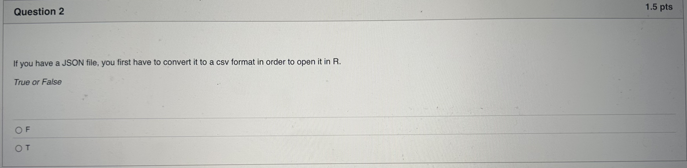
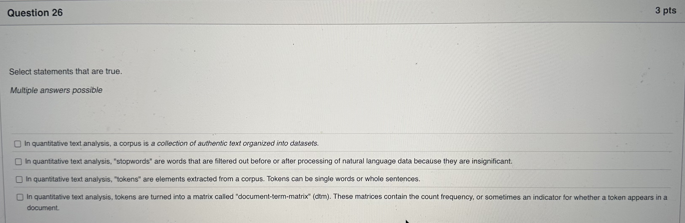
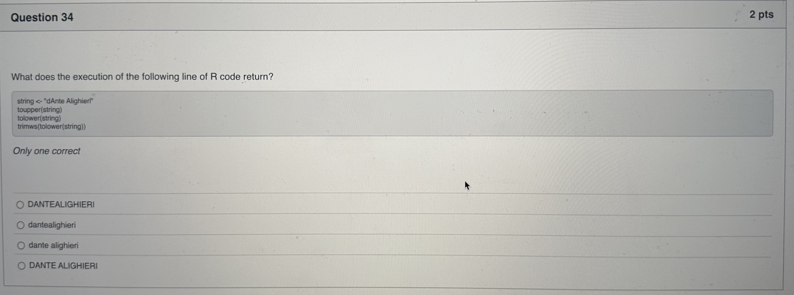

```{r setup, include=FALSE}
knitr::opts_chunk$set(echo = TRUE)
```

## Mock Exam 2024

**Quiz instructions**

• You have 90 minutes to complete the exam
• For each of the true or raise questions, decide whether the statement is TRUE (T) or FALSE (F). You will receive 1 5 points for a correct response and O points for an incorrect response A maximum of 37.5 points can be achieved in this part \
\
• For each of the multiple answers possible questions, decide which of the possible responses are correct. Either ONE or SEVERAL (or even ALL) of the response statements can be correct.
You will receive 3 points for choosing all the correct options/statements. Each correct response gives 0.75 points. Each selected incorrect option will cancel out the points awarded to a correctly chosen option (e.g., choosing one correct and one incorrect option will leave you with zero points). Points will not go below 0 regardless of your choices. Your best strategy is to select only the options that vou are fairly certain are true. A maximum of 15 points can be achieved in this part \
\
• For each of the only one correct questions, decide which of the possible responses is correct. For each question ONLY ONE of the possible responses is correct. Select only one of the response statements per question. You will receive 2 points for a correct response and 0 points for an incorrect response. A maximum of 20 points can be achieved in this part. \
\
• For each of the essay questions, write down your answer. The goal of the essay questions is to test whether vou have developed a good practical understanding of the tools we presented in class. To get full points, vou are expected to describe vour reasoning and the sequence of code you would write in plain English using higher-level R concepts with precision. For instance, we would like you to write "I would use ggplot with a geom_histogram" when describing the creation of a histogram. You are weldome to mention -commands if this helps vou. A maximum of 20 points can be achieved in this part \
\

## Sooooo... I have solved does questions and provided detailed explanations below.


Question 1
---


The **rbind()** function in R combines data frames, matrices, or vectors by row, stacking them on top of each other. It stands for "row bind." Each input must have the same number of columns (or compatible dimensions)

```{r rbind functions}
df1 <- data.frame(A = 1:3, B = 4:6)
df2 <- data.frame(A = 7:9, B = 10:12)
result <- rbind(df1, df2)
```


```{r rbind, echo=FALSE}
result
```


## FALSE
However, the rbind() function requires that the columns in all data frames have the same names and be in the same order. If the column names or orders are different, rbind() will throw an error.

---

Question 2
---



## False
You do not need to convert a JSON file to a CSV format before opening it in R. R provides libraries specifically designed to read and process JSON files directly.


```{r librarys, echo=TRUE}
library(jsonlite)
data <- fromJSON("data/simple_example.json")
data
```

---

Question 3
---


lets not assume lets run does lines

```{r Question3}
df <- data.frame(Teams = c("Manchester United", "Manchester City", "Inter Milan", "Real Madrid"),
                 Country = c("England", "England", "Italy", "Spain"))
median(df$Country)
```

Some theory provided by chatgpt:
1. **Understanding median()** in R:
The median() function in R is used to calculate the statistical median of numeric vectors.
In this case, df$Country is a character vector ("England", "England", "Italy", "Spain"), not numeric. \
Applying median() to a character vector will result in an error, as the function does not know how to compute a median for non-numeric data.

\

## and the answer is... False 


---

Question 4
---


\
\
\
<https://www.youtube.com/watch?v=y3YL5dUJNvc>
\
\
\
if you don't have 4 minutes like me ask ChatGPT:
\
**Factors** in R are a data structure used to represent categorical variables. They store data as levels (unique categories) and are particularly useful for handling nominal or ordinal data efficiently.

```{r categorical variables & factors}
# lets see how this works.
gender <- c("Male", "Female", "Male", "Female", "Female")

categorical_variable <- factor(gender)

categorical_variable
```

## True

---

Question 5
---


1. What does **merge()** do in R?\
The merge() function combines two datasets based on a common column (by).
In this case, the datasets emp_df and dept_df are merged using the dept_id column.
The argument all.x = TRUE specifies a **left join**, meaning all rows from emp_df are retained, and matching rows from dept_df are added. Unmatched rows from dept_df will have NA. \
2. What happens to the by column (dept_id)?\
The by column is always included in the merged dataset unless explicitly removed or renamed.
Therefore, the merged dataset df2 will include the dept_id variable as part of the result.\
3. Why is the answer False?\
The claim states that df2 "will not contain the variable dept_id," which is incorrect. Since the dept_id is used as the key for merging, it will remain in the resulting dataset.\

```{r merging DF}
emp_df <- data.frame(emp_id = 1:3, dept_id = c(101, 102, 103))
dept_df <- data.frame(dept_id = c(101, 102), dept_name = c("HR", "Finance"))

df2 <- merge(x = emp_df, y = dept_df, by = "dept_id", all.x = TRUE)

# Output
df2

```


## False


---

Question 6
---


why sould anyone do this??


## its false

---

Question 7
---


What is an Inner Join?
An Inner Join combines rows from two datasets based on matching values in the specified key column(s). Only the rows that have matches in both datasets are included in the resulting dataset.

```{r inner join}

df1 <- data.frame(ID = c(1,2,3), Name = c("Alice", "Bob", "Christian"))

df2 <- data.frame(ID = c(2,3,4), Age = c(25,30,35))

inner_join <- merge(df1, df2, by="ID")
inner_join
```

## its true

---

Question 8
---


What is an Outer Join?
An Outer Join (also referred to as a Full Join) merges two datasets and includes all rows from both datasets. For rows that do not have matches in one dataset, the corresponding columns from the other dataset will contain NA.


```{r outer join}
# Dataset 1
df1 <- data.frame(ID = c(1, 2, 3), Name = c("Alice", "Bob", "Charlie"))

# Dataset 2
df2 <- data.frame(ID = c(2, 3, 4), Age = c(25, 30, 35))

# Perform an Outer Join (Full Join)
OJ <- merge(df1, df2, by = "ID", all = TRUE)
OJ

```

## thus its true

---

Question 9
---


```{r libarys2, echo=FALSE}
library(tidyverse)
```


```{r}
# Custom background color
ggplot(mtcars, aes(x = wt, y = mpg)) +
  geom_point() +
  theme(panel.background = element_rect(fill = "beige"))
#who the fuck would choose *beige* must be an AI

```
\
\
Anyway the anwser is:
\
## false

---

Question 10
---


why should I do that 
```{r plot}
mashalla <- data.frame(
  x = c(1, 2, 3, 4, 5),
  y = c(2, 4, 6, 8, 10)
)


ggplot(mashalla, aes(x = x, y = y)) +
  geom_point()
#this gives a Scatter plot based on the data mashalla
```


## false

---

Question 11
---


R can do operations like:
 +
 -
 *
 /
 etc.

the point is that the operation is applied to each element of the Vector, and the result is obiviously a vector too.

```{r vectors}
numbers <- c(1:3)
numbers + 5
```

## False

---

Question 12
---


When a computer processes code or text, it converts it into binary (0s and 1s) because computers operate using binary logic. Text is encoded into binary using standards like ASCII (e.g., A = 65 = 01000001 in binary) or UTF-8 for broader character support. This binary representation allows the computer's hardware to process data efficiently through electrical signals representing "on" (1) and "off" (0). Encoding ensures all data—text, images, audio—can be stored and processed in binary format.
*this is mentioned in lecture 3*

## True


---

Question 13
---


\
The **names()** function in R is used to get or set the names of elements in an object, such as a vector, list, or data frame.

```{r dataframes and names()}
mydata <- data.frame(a = c(1:3), b = c(4:6), d = c(10:12))
names(mydata)
```

## True

---

Question 14
---


the names in the vector are not defined as well there is the factor function apply which generates levels.


```{r names()}
mymates <- factor(c("carl", "siddha", "tom", "sandrine"))
names(mymates)
```


## False

---

Question 15
---


Variables in a data frame can be accessed not only by their name but also by their index position or other notations.

```{r filtering}
df <- data.frame("a" = c(1:10), "b" = c(10:19))
df[1,1] 

```

## False

---

Question 16
---


In a function, there has to be **return()** to get an output.

```{r functions}

my_function <- function(x){
  result <- x^2
  return(result)
}
my_function(3)

```

## False

---

Question 17
---


this is correct, because the sum function can not be applied to a vector that includes character values.


```{r sum of a vector}

sum(c(1:3))
#sum(c("1","2","3"))

```

## TRUE

---

Question 18
---


The source() function in R is used to read and evaluate the code contained in an external R script file.
If the file path works and there is a file with R code it will work.

## TRUE

---

Question 19
---

Because 19 was somehow unreadable here is the question

sum(c(1,2,NA,3)) will return 6

True or False

```{r sum for NA}
sum(c(1,2,NA,3))

```
now I have eye cancer because of this picture.

## False

---

Question 20
---


The **str()** function in R is used to display the **structure of an object**. It provides a compact and human-readable summary of an object’s data type, dimensions, and contents, without modifying the object.

```{r str()}
data <- data.frame("myvaraible" = c(1,2,3,4))

str(data$myvaraible)
#Numerical vales form 1 to 4
```
---

Question 21
---


this is way to true:

```{r while loop}
n <- 0

#while (n<5) {
#  print("I don't want no more")
#}

#the joke is that I looky nearly just crashed my document without saving haha.

while (n<5){
 n <- n + 1
 print("nearly crashed")
}


```
## True

---

Question 22
---


In R, all columns of a matrix must have the same length, as a matrix is a two-dimensional structure where all rows and columns are of equal size.
Furthermore it has to consist of the same type of data.


```{r matrices}

#my_matrix <- matrix(c(1:10), nrow:3)

#my_matrix
#throws an error
```


## True


---

Question 23
---

```{r Question 23}
#to make it more humanly readable:

SuperMarket <- data.frame(
  Firm = c("Migros", "Migros", "Coop", "Coop", "Denner"),
  Profit = c(200,220,190,194,120)
)
SuperMarket <- split(SuperMarket, SuperMarket$Firm)

#SuperMarket is a list of 3 elements (TURE/FALSE)

```


The split() function creates a list of subsets of the data frame.
Each subset corresponds to rows where Firm matches a specific value.
The statement is True because the resulting SuperMarket object is indeed a list with 3 elements, one for each unique firm.

```{r subset via split function}
SuperMarket
str(SuperMarket)
```


---

Question 24
---


dim() gives the dimension (number of rows, number of columns)
cbind(...) stands for column binding. It combines the matrix and the vector as columns to form a new matrix.

Basicly the cbind creates a new matrix. The dimension functions gives the number of rows 2 and the number of columns.

```{r dimensions}
dim(
  cbind(
    matrix(c(1:4), ncol = 2),
    c(1,2)
  )
)


```


---

Question 25
---


it would be easy to calculate with hex see this viedo: <https://www.youtube.com/watch?v=-6Je-FuAufk>
20 / 16 = 1 Remainder = 4
1-4

lets take 200:
220 / 16 = 13 Remainder 12
DC


but because I was boared last time I studied this data handling course I have writen a little skript
```{r hex to dec}
#converting decimal to hex
remainder <- c()
n <- 220

while (n > 0) {
  if (n %% 16 == 0) {
    remainder <- c(remainder, 0)
  } else {
    remainder <- c(remainder, n %% 16)
  }
  last_remainder <- remainder[length(remainder)]
  n <- (n - last_remainder)/16
  n
  remainder
  
}
remainder <- rev(remainder)
remainder[remainder == 10] <- c("A")
remainder[remainder == 11] <- c("B")
remainder[remainder == 12] <- c("C")
remainder[remainder == 13] <- c("D")
remainder[remainder == 14] <- c("E")
remainder[remainder == 15] <- c("F")
remainder
```


---

Question 26
---


see this for more info: <https://umatter.github.io/datahandling/text-data.html#one-package-to-rule-them-all-quanteda>

thats what chatgpt said:

1. corpus is a structured collection of authentic texts used for analysis => True
2. Stopwords (like "and", "the", "is") are often removed because they carry little meaning in quantitative text analysis. => True
3. Token are typically smaller units (like words or pharses) extraceted from text. Sentences are raely treated as tokens. => False
4. A document-term matrix (DTM) is used to represent token frquencies across documents. => true 


---

Question 27
---


1. the first one is partialy true but usually you load tideyverse (which contains ggplot2)
2. this is just cap nobody does this and there is no reason 
3. cap I can make one:
4. could be true idk. (chatgpt says its true)

```{r scatterplot}


my_df <- data.frame(
  x = swiss$Education,
  y = swiss$Catholic
)

ggplot(my_df, aes(x = x, y = y)) +
  geom_point()
```


---

Question 28
---


1.


V1 is an integer column (int) with values 1, 2, 9.
V3 is a character column (chr) with values "a", "b", "3".
The data frame has 3 observations (rows) and 2 variables (columns).

1. is vaild, a data frame can contain columns of differnet data types.  => true
2. will produce an error (because the sum() doesn't work on character vectors) => false
3. nrow(df) returns 3 and the dataframe has 3 observations (rows). => true
4. it will not produce an error because its an interger column => false

---

Question 29
---


```{r function stuff}

my_function <- function(x,y=5){
  if(x>y){
    warning("x is greater than y")
  }
  d <- floor(y/x)
  
  result = c(d,y-d*x)
  return(result)
}
a <- my_function(10)
str(a)
my_function(5)
my_function(4,9)
```

1. false, it returns a result even if x>y
2. true
3. true it does not produce an error
4. true
---

Question 30
---


I guess you don't have to study computer science to anwser this one.

---

Question 31
---


```{r dataframe dates}
df <- data.frame(Year = c(2005, 2005, 2007),
                 Month = c(1:3))
df$Year <- ifelse(df$Year == 2005, 2015, df$Year)

df
```

1. False because of the months
2. is correct
3. is wrong 
4. is not correct but this is what the df has lookt before the ifelse condition.


---

Question 32
---


1. taking the mean will work so 1. is correct => true
2. json_data$company contains multiple elments (name, departments), so it will be a list with 2 elements => false
3. false json_data[[1]] accesses the first top-level object, which is "company".
json_data[[1]][[2]] attempts to access the second element of json_data$company. This corresponds to departments, which contains a list of multiple records, not a single string. 
4. json_data is not stored as a JSON object; it is converted into an R structure (likely a list or data frame) by fromJSON(). => false


---

Question 33
---


**tidyverse::pivot_wider()**

---

Question 34
---



**toupper(string)**
Purpose: Converts all characters in the string to uppercase.

**tolower(string)**
Purpose: Converts all characters in the string to lowercase.

**trimws(tolower(string))**
Purpose:
tolower(string): Converts the string to lowercase.
trimws(): Removes leading and trailing whitespace from the string.
```{r string}
string <- "dAnte Alighieri"
toupper(string)
tolower(string)
trimws(tolower(string))
```

=> DANTE ALIGHIERI

---

Question 35
---


```{r binary to decimal}
2^5+0^4+2^3+0^2+2^1+0^0
#42
```


```{r dec to binary}
remainder <- c()
number <- 42

while (number > 0) {
  if (number %% 2 == 0) {
    remainder <- c(remainder, 0)
  }
  else {
    remainder <- c(remainder, 1)
    number <- number-1
  }
  number <- number/2
}
binary <- rev(remainder)
binary
```


---

Question 36
---


both


---

Question 37
---


character

```{r character vector}
x <- c(1,2,3, "Four", "Five")
class(x)

```


---

Question 38
---


```{r dimension for dataframe}
df <- data.frame(
  name = c("Adam", "Eve"),
  age = c(12, 12, 13, 13, 14, 14),
  grades = c(12, 12, 10, 11, 9, 11)
)
df
df$grades <- df$grades/2 
df$city <- "St. Gallen" 
df$ID <- c(1,2,1,2, 1,2)
df
dim(df)
```

=> correct is dim(df)=c(5,6)


---

Question 39
---


All values in column month equal to "Feb" are repalced with the value "Februar"

---

Question 40
---


by Chatgpt:

Key Considerations:
Data Matching:
To compare grades by gender, you need to combine information from both datasets.
Since the second dataset only has rows for exams taken, it is incomplete, and you need to preserve all students from the first dataset to account for missing exams.
Joining Method:
cbind: Combines datasets column-wise but requires both datasets to have the same number of rows, which doesn’t apply here. Not suitable.
Left Join: Keeps all rows from the first dataset (students) and adds matching rows from the second dataset (grades). This ensures that all students are included, even if they missed exams. This is the correct choice.
Inner Join: Only keeps rows with matching data in both datasets, which would exclude students who missed all exams. Not suitable.
Right Join: Keeps all rows from the second dataset (grades) and adds matching data from the first dataset (students). This would exclude students who didn’t take any exams. Not suitable.
Correct Answer:
"I join the two datasets using a left join (with the first dataset being left)."
This ensures all students from the first dataset are included, even if they didn’t take any exams. It’s the correct approach for calculating the drop-out rate and analyzing grades by gender.


# finished 

